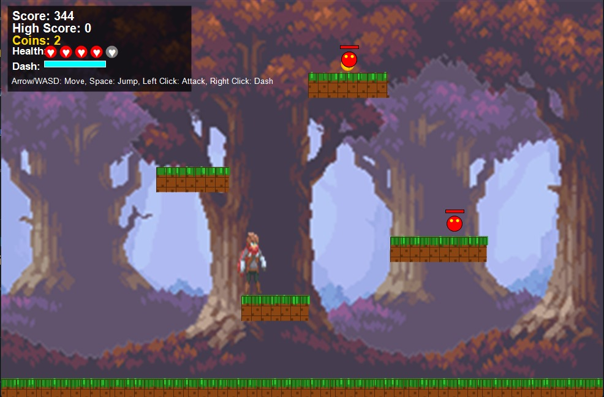

# 🎮 Eternal Path

**Eternal Path** adalah game **endless 2D platformer** berbasis **Windows Forms (WinForms)** di mana pemain berlari, melompat, dan menyerang musuh dalam dunia yang terus bergerak. Dengan kontrol sederhana dan gameplay cepat, Eternal Path cocok untuk penggemar aksi dan refleks tinggi.

---

## 🛠️ Teknologi yang Digunakan

- 🧠 **Bahasa**: C#
- 🖼️ **Framework**: .NET 9.0, WinForms
- 🔧 **IDE**: Visual Studio Code

---

## 🚀 Fitur

- 🔁 **Endless Level Generation**
- 🦶 **Platforming dengan Gravity & Collision Detection**
- ⚔️ **Sistem Serangan Pemain (Attack)**
- 👾 **Enemy AI Sederhana**
- 🧱 **Tile-based Environment**
- ❤️ **Sistem Health**
- 💰 **Coin dan Skor**

---

## 📦 Cara Menjalankan

1. Clone repositori:

   ```bash
   git clone https://github.com/Araryarch/Eternal-Path.git
   cd Eternal-Path
   ```

2. Buka file `.sln` dengan **Visual Studio** atau **Visual Studio Code**.

3. Tekan `Ctrl + F5` atau klik `Start Without Debugging` untuk menjalankan game, atau gunakan dotnet run pada `Program.cs` jika pakai Visual Studio Code

---

## 🎮 Kontrol Pemain

| Aksi          | Tombol               |
| ------------- | -------------------- |
| Gerak         | Panah Kiri/Kanan ← → |
| Lompat        | Panah Atas ↑ / Spasi |
| Serang        | Klik Kiri            |
| Dash          | Klik kanan           |
| Arah Karakter | Arah Mouse           |

---

## 📸 Cuplikan Layar

> Gameplay Singkat

```md

```

---

## 🤝 Kontribusi

Ingin ikut berkontribusi? Silakan fork proyek ini, buat fitur atau perbaikan, lalu ajukan pull request.
Saran dan masukan juga sangat diterima!

---

## 📃 Lisensi

##### Game ini dibuat oleh

| Nama                 | NRP        | Github    |
| -------------------- | ---------- | --------- |
| Ararya Arka Anugraha | 5053241050 | Araryarch |
| Syafiq Ahmad Izzudin | 5053241037 | Safeqq    |

MIT License © 2025 — \ Ararya Arka - Syafiq Ahmad

---

## 📫 Kontak

📧 Email: [araryaarch@gmail.com](mailto:araryaarch@gmail.com)
🐙 GitHub: [github.com/araryarch](https://github.com/araryarch)

---
